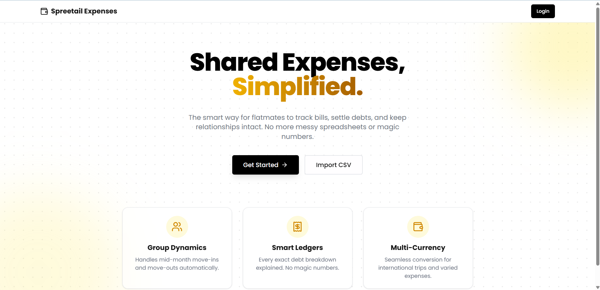

# Shared Expenses App

 
*(Replace `./screenshot.png` with a path to your application's screenshot)*

A full-stack web application designed for flatmates to track shared expenses, settle debts securely, and ingest historical spreadsheet data automatically. Built with Next.js 15, Tailwind CSS, NextAuth, and SQLite (Prisma).

## AI Used
This application was rapidly developed with the assistance of **Google DeepMind Antigravity AI (Gemini 3.1 Pro)** acting as an autonomous engineering co-pilot.

---

## Setup Instructions

Follow these step-by-step instructions to run the application locally on your machine.

### Prerequisites
- **Node.js**: v18 or higher recommended.
- **npm**: Comes with Node.js.

### 1. Clone the Repository
Navigate to the project folder via your terminal. If you are starting fresh, clone it:
```bash
# If using a git repository:
git clone <https://github.com/VisheshRaj11/Spreetail>
cd expense-app
```

### 2. Install Dependencies
Install all the required NPM packages (Next.js, Prisma, Tailwind, Sonner, etc.):
```bash
npm install
```

### 3. Environment Variables
Create a `.env` file in the root of the project directory. The application relies on `NEXTAUTH_SECRET` for secure session management and `DATABASE_URL` for the SQLite database connection.

Copy and paste the following into your `.env` file:
```env
DATABASE_URL="file:./dev.db"
NEXTAUTH_SECRET="my_super_secret_dev_key_123_spreetail"
NEXTAUTH_URL="http://localhost:3000"
```

### 4. Database Initialization
This project uses SQLite to fulfill the technical requirement of using a "Relational DB" without requiring Docker or manual Postgres setup. 

First, generate the Prisma client:
```bash
npx prisma generate
```

Then, push the schema to create your local `dev.db` file:
```bash
npx prisma db push
```

### 5. Seeding the Database
To populate the necessary mock users (Aisha, Rohan, Priya, Meera, Dev, Sam) and default group structure, run the seed command:
```bash
npx prisma db seed
```

### 6. Running the Development Server
Start the Next.js development server:
```bash
npm run dev
```

Open your browser and navigate to:
**[http://localhost:3000](http://localhost:3000)**

---

## How to Test

1. Visit `http://localhost:3000` to view the Landing Page.
2. Click **Get Started** and select a user profile (e.g. Aisha) from the secure Auth dropdown to log in.
3. Once in the dashboard, click **Import CSV**.
4. Upload the provided `expenses_export.csv` file. 
5. The application's anomaly engine will parse the file, fix negative numbers, convert foreign currencies, handle date issues, and generate a real-time **Import Report**!
